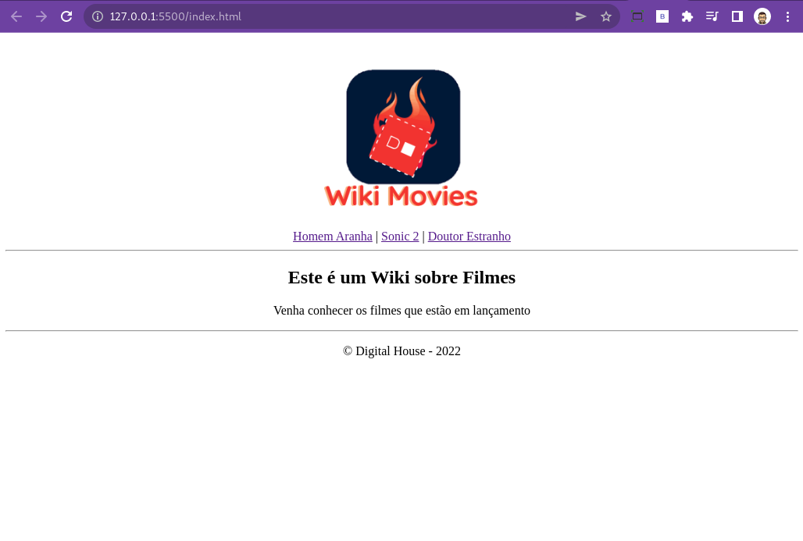
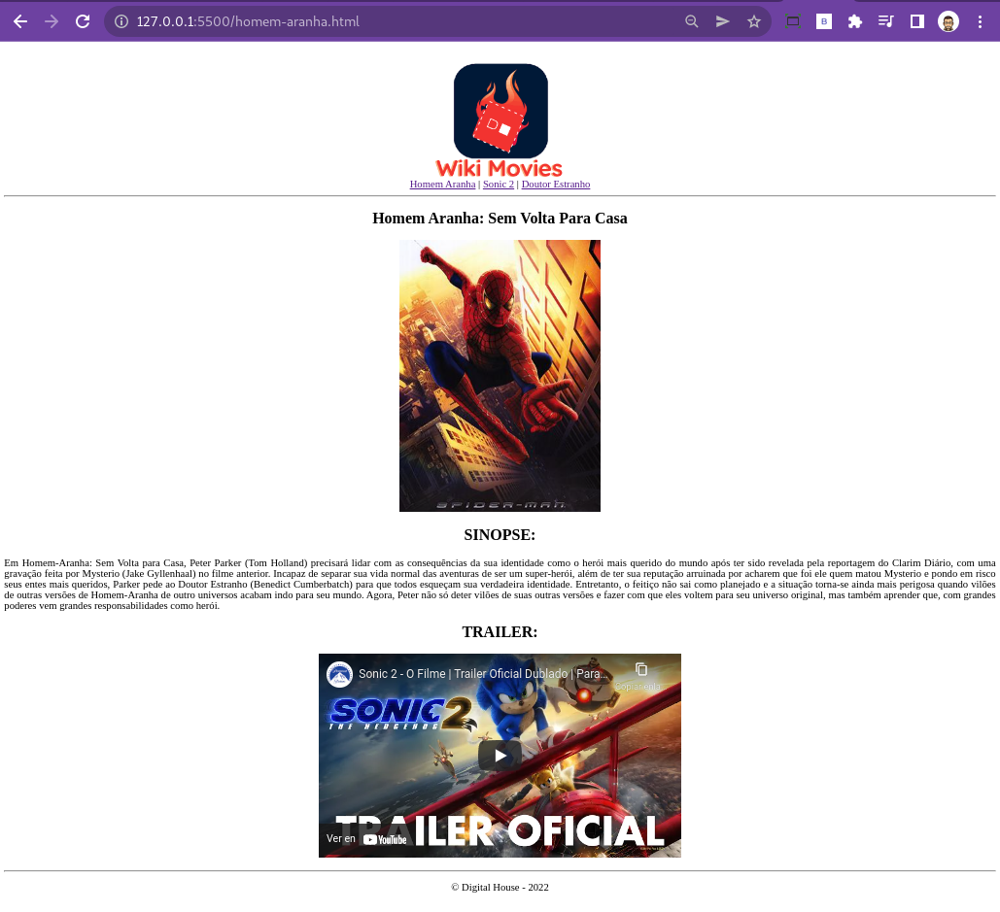
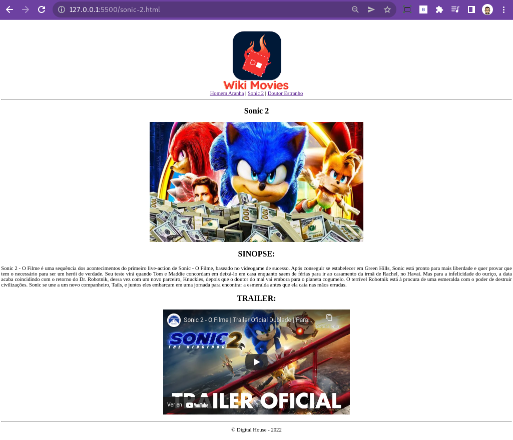
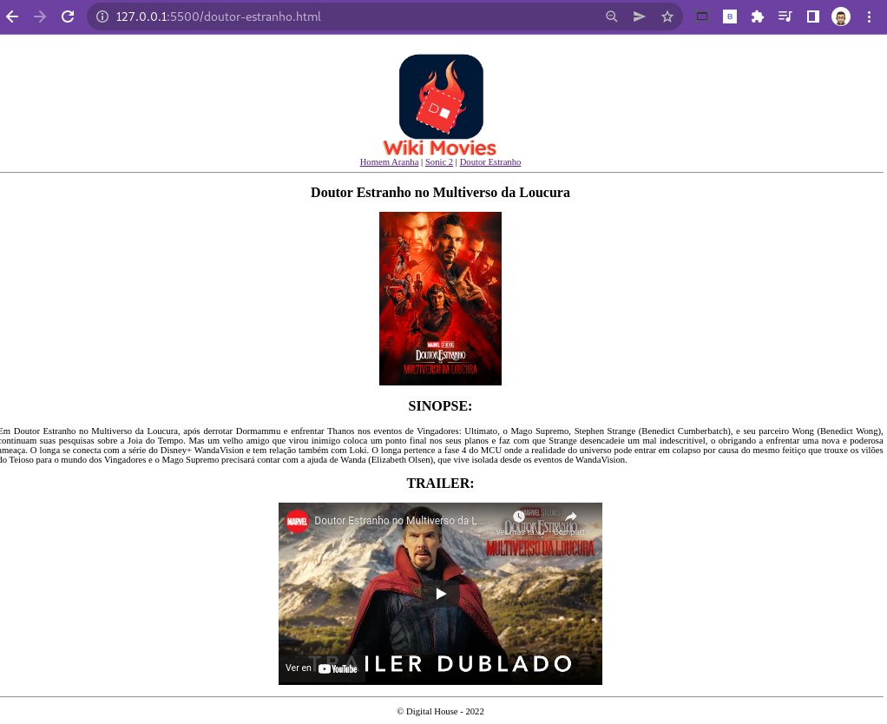

### Front-End - Exercícios de HTML

1 - Observações

- Fazer o fork desse repositório
- Clonar o repositório do fork
- Fazer o que é solicitado pelo exercício.
- Comitar cada página criada.
  - Exemplo:
    - `git commit -m "finalizada a pagina index"`
    - `git commit -m "finalizada a pagina sonic"`
    - `git commit -m "finalizada a pagina homem aranha"`
    - `git commit -m "finalizada a pagina doutor estranho"`
- É para existir 4 commits nesse exercício.
- Depois de comitar, realizar o push do repositório.
- Depois fazer o pull request do repositório do fork.
Aranha

2 - Escopo do projeto

- Seu objetivo é criar um Wiki de filmes.
- Seu projeto terá 3 páginas contento os filmes em lancamento.
  - Doutor Estranho
  - Sonic 2
  - Homem Aranha
- Deve ficar igual o exemplo das páginas abaixo.

> Pagina `index.html'

> Pagina `homem-aranha.html'

> Pagina `sonic-2.html'

> Pagina `doutor-estranho.html'

###### tags: `internet` `navegação` `html` `exercícios`